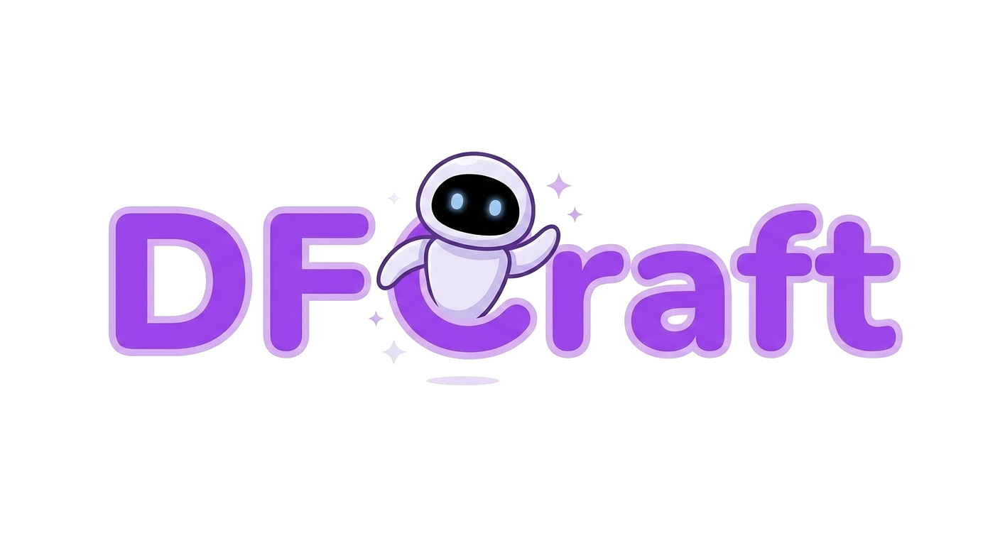

<p align="center">
  
</p>

<p align="center">
  
  
  
  
</p>

<p align="center">
  
  
  
  
</p>

<p align="center">
  
  
  
  
</p>

---

## Features

### Pomodoro Timer
- Customizable focus sessions and break durations
- Smart notifications when sessions end
- Auto-transition between focus and break phases

### Task Management
- Keep track of your tasks alongside your timer
- Quick-add and manage todos without leaving the extension

### Ambient Sound Library
- Browse a growing library of ambient sounds (rain, nature, white noise, cafe)
- Background audio playback with a built-in player
- Search and filter sounds by category
- Lazy-loaded list for smooth performance with large libraries

### Distraction Blocking
- Block distracting websites during focus sessions
- Block browser notifications while focusing
- Redirect blocked pages to a custom "stay focused" screen

### Statistics & Tracking
- Visualize your focus time with interactive charts
- Track your productivity over time

### Multi-Language Support
- English, French, and Arabic
- RTL layout support for Arabic

### Customizable
- Light and dark themes
- Adjustable timer durations
- Personalized distraction block lists

---

## Tech Stack

| Technology | Version | Purpose |
|------------|---------|---------|
| [React](https://react.dev) | 19.1.1 | UI framework |
| [Vite](https://vitejs.dev) | 7.1.6 | Build tool & dev server |
| [Tailwind CSS](https://tailwindcss.com) | 3.4.16 | Utility-first styling |
| [MUI](https://mui.com) | 7.3.5 | Component library (Skeletons, etc.) |
| [Axios](https://axios-http.com) | 1.12.2 | HTTP client for sound library API |
| [ECharts](https://echarts.apache.org) | 6.0.0 | Charts for statistics |
| [Lucide React](https://lucide.dev) | 0.544.0 | Icon library |
| [Bootstrap Icons](https://icons.getbootstrap.com) | 1.13.1 | Additional icons |
| [WebExtension Polyfill](https://github.com/mozilla/webextension-polyfill) | 0.12.0 | Cross-browser API compatibility |
| [ESLint](https://eslint.org) | 9.35.0 | Code linting |

---

## Installation

### For Development

1. **Clone the repository:**
   ```bash
   git clone https://github.com/aymen-igri/DFCraft_project.git
   cd DFCraft_project
   ```

2. **Install dependencies:**
   ```bash
   npm install
   ```

3. **Build for your browser:**
   ```bash
   # Build for Chrome
   npm run build:chrome

   # Build for Firefox
   npm run build:firefox

   # Build for both
   npm run build:all
   ```

4. **Load in browser:**

   **Chrome / Brave:**
   - Go to `chrome://extensions/`
   - Enable **Developer mode** (top right)
   - Click **Load unpacked**
   - Select the `dist/chrome/` folder

   **Firefox:**
   - Go to `about:debugging#/runtime/this-firefox`
   - Click **Load Temporary Add-on**
   - Select any file in `dist/firefox/`

### For Users

1. Download the latest release from [Releases](https://github.com/aymen-igri/DFCraft_project/releases)
2. Follow the installation guide in the release notes

---

## Available Scripts

| Script | Description |
|--------|-------------|
| `npm run dev` | Start Vite dev server |
| `npm run build` | Build the frontend |
| `npm run build:chrome` | Build extension for Chrome |
| `npm run build:firefox` | Build extension for Firefox |
| `npm run build:all` | Build for both browsers |
| `npm run lint` | Run ESLint |
| `npm run package:chrome` | Package Chrome build into a .zip |
| `npm run package:firefox` | Package Firefox build into a .zip |

---

## Project Structure

```
DFCraft_project/
├── src/
│   ├── components/          # UI components (Timer, SoundsList, TodoList, etc.)
│   ├── pages/               # Page views (Home, SoundPlayer, Settings, etc.)
│   ├── shared/              # Shared utilities, hooks, context, i18n
│   ├── background/          # Extension service worker (audio, timer, blocking)
│   ├── content/             # Content script (distraction blocking)
│   ├── popup/               # Extension popup entry
│   └── options/             # Extension options page
├── public/
│   ├── icons/               # Extension icons and logo
│   ├── sounds/              # Notification sounds
│   └── manifest.chrome.json # Chrome manifest (Manifest V3)
├── build-scripts/           # Chrome/Firefox build scripts
├── .env                     # Sound library API URLs
└── package.json
```

---

## Browser Support

| Browser | Status |
|---------|--------|
| Chrome | Supported (Manifest V3) |
| Firefox | Supported |
| Chromium-based | Supported |
| Firefox-based | Supported |
---

## License

This project is licensed under the MIT License — see the [LICENSE](LICENSE) file for details.

---

<div align="center">
  <p>If you like this project, give it a star on GitHub!</p>
</div>
